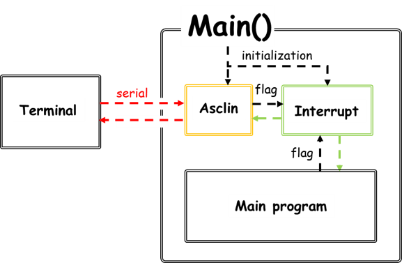
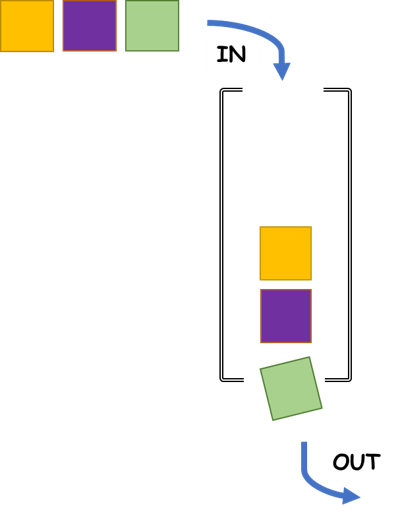
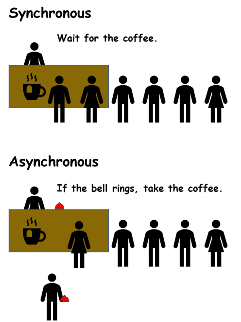
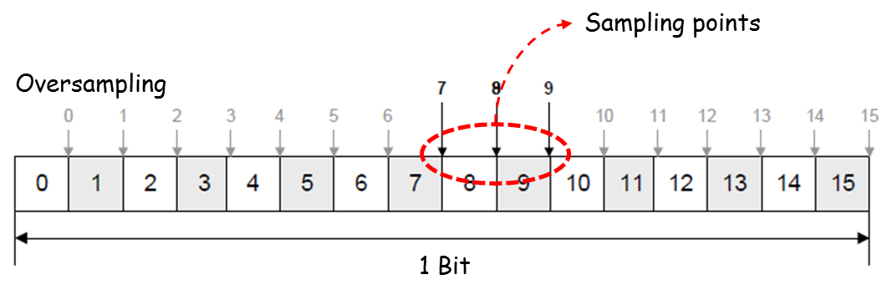

# Hello world

## Objectives
* 터미널 프로그램의 필요성 인식
* Asclin를 이용한 serial 통신 구현

## References
*	iLLD_1_0_1_4_0_TC2xx_Release.zip; iLLD source and doc
*	iLLD_Demos_1_0_1_4_0_TC2xx.zip; iLLD examples
*	[TC23x TC22x Family User's Manual v1.1](../references/tc23x_tc22x_um_v1.1.pdf)

## Example Description

#### 개요

-	실시간 입출력 인터페이스 구현
	- 프로그램 부피에 비례해 커지는 compile cost
	- 실시간 입출력 비교를 통한 개발 효율 향상

#### 구현

*	터미널을 통한 입력과 출력의 확인

#### 구조

*	Asclin을 향한 데이터 처리를 인터럽트 flag로 하는 실시간 입출력 시스템

- 터미널
	- 입출력장치와의 커뮤니케이션 인터페이스
	- 오픈소스 프로그램인 Tera Term을 이용

## Hardware
-	​Application Kit TC237 V1.0

## iLLD - related

####	Asclin( Asynchronous/synchronous Interface )

- FIFO(First In First Out) 방식의 데이터 처리

- 필요에 따른 비동기/동기식 mode selection
	- 동기식 : 요청이 수행될 때 까지 대기, 간단하고 직관적
	- 비동기식 : 요청과 결과가 동시에 일어나지 않음, 복잡하지만 효율적

- 인터럽트를 이용한 데이터 송수신 시스템
	- 세 가지 종류로 구성: 입력, 출력, 에러
######
- How to use

**1. AsclinAsc 기본 설정구성을 구조체 형식화**
~~~
/* 비동기식 serial 통신 사용 */
IfxAsclin_Asc_Config ascConfig;
IfxAsclin_Asc_initModuleConfig(&ascConfig, &MODULE_ASCLIN0);
~~~

**2. 통신을 위한 각종 설정치 입력**
~~~
/* baudrate 설정 */
ascConfig.baudrate.prescaler    = 1;
ascConfig.baudrate.baudrate     = 115200;
ascConfig.baudrate.oversampling = IfxAsclin_OversamplingFactor_4;

/* 인터럽트 설정 */
ascConfig.interrupt.txPriority    = ISR_PRIORITY_ASC_0_TX;
ascConfig.interrupt.rxPriority    = ISR_PRIORITY_ASC_0_RX;
ascConfig.interrupt.erPriority    = ISR_PRIORITY_ASC_0_EX;
ascConfig.interrupt.typeOfService = (IfxSrc_Tos)IfxCpu_getCoreIndex();

/* 입출력 버퍼 설정 */
ascConfig.txBuffer     = g_AsclinAsc.ascBuffer.tx;
ascConfig.txBufferSize = ASC_TX_BUFFER_SIZE;
ascConfig.rxBuffer     = g_AsclinAsc.ascBuffer.rx;
ascConfig.rxBufferSize = ASC_RX_BUFFER_SIZE;

/* 핀 설정 */
const IfxAsclin_Asc_Pins pins = {
		NULL_PTR,                     IfxPort_InputMode_pullUp,        /* CTS pin not used */
		&IfxAsclin0_RXA_P14_1_IN, IfxPort_InputMode_pullUp,            /* Rx pin */
		NULL_PTR,                     IfxPort_OutputMode_pushPull,     /* RTS pin not used */
		&IfxAsclin0_TX_P14_0_OUT, IfxPort_OutputMode_pushPull,         /* Tx pin */
		IfxPort_PadDriver_cmosAutomotiveSpeed1
};
ascConfig.pins = &pins;

/* 초기화 */
IfxAsclin_Asc_initModule(&g_AsclinAsc.drivers.asc0, &ascConfig);
~~~

**3. 인터럽트 install**
~~~
/* Tx interrupt */

IFX_INTERRUPT(asclin0TxISR, 0, ISR_PRIORITY_ASC_0_TX)
{
    IfxAsclin_Asc_isrTransmit(&g_AsclinAsc.drivers.asc0);
}

/* Rx interrupt */

IFX_INTERRUPT(asclin0RxISR, 0, ISR_PRIORITY_ASC_0_RX)
{
    IfxAsclin_Asc_isrReceive(&g_AsclinAsc.drivers.asc0);
}

/* Ex interrupt */

IFX_INTERRUPT(asclin0ErISR, 0, ISR_PRIORITY_ASC_0_EX)
{
    IfxAsclin_Asc_isrError(&g_AsclinAsc.drivers.asc0);
}
~~~

**4. 입출력 확인을 위한 간단한 function 제작**
~~~
void AsclinAscDemo_run(void)
{
    /* 중략 */

    /* Tx data 출력 */
    IfxAsclin_Asc_write(&g_AsclinAsc.drivers.asc0, g_AsclinAsc.txData, &g_AsclinAsc.count, TIME_INFINITE);

    /* Rx 데이터 저장 */
    IfxAsclin_Asc_read(&g_AsclinAsc.drivers.asc0, g_AsclinAsc.rxData, &g_AsclinAsc.count, TIME_INFINITE);

    /* Rx 데이터를 출력함과 동시에 데이터가 제대로 들어왔는가 판단하여 message 출력 */

    if (errors)
    {
    	IfxAsclin_Asc_write(&g_AsclinAsc.drivers.asc0, g_AsclinAsc.rxData, &g_AsclinAsc.count , TIME_INFINITE);
        printf("ERROR: received data doesn't match with expected data (%lu mismatches)\n", errors);
    }
    else
    {
        IfxAsclin_Asc_write(&g_AsclinAsc.drivers.asc0, g_AsclinAsc.rxData, &g_AsclinAsc.count , TIME_INFINITE);
        printf("OK: received data matches with expected data\n");
    }

   printf("Asclin Asc data transfers are finished\n");
}
~~~

 ####	터미널 동작 확인
- 프로그램 디버깅 후 터미널이 제대로 동작하는지 확인

**1. Tera term 실행 및 serial 통신 포트 선택**

**2. Serial 통신 port 설정을 하는 곳**

**3. Port나 baudrate가 board에 프로그래밍한 값과 같은지 확인**

**4. 데이터 입출력 확인**

**5. UDE와 연결되있을 시 printf로 설정한 메시지 출력도 확인가능**

## 추가적인 설명

#### 노이즈 제거
- 코드에 문제가 없어도 가끔씩 노이즈 에러가 발생하는 것을 볼 수 있음

- Asclin 모듈 안에는 몇 가지 노이즈 제거 기능이 존재
- 그 중 oversampling을 이용한 median filter 방법

- How to use
~~~
/* oversampling size 설정 */
ascConfig.baudrate.oversampling = IfxAsclin_OversamplingFactor_16;

/* 샘플링 포인트 개수 */
ascConfig.bitTiming.medianFilter        = IfxAsclin_SamplesPerBit_three;

/* 어느 position의 bit를 중앙값으로 사용할 것인가 */
ascConfig.bitTiming.samplePointPosition = IfxAsclin_SamplePointPosition_8;
~~~

- 결과
	- 필터링 전

	- 필터링 후

